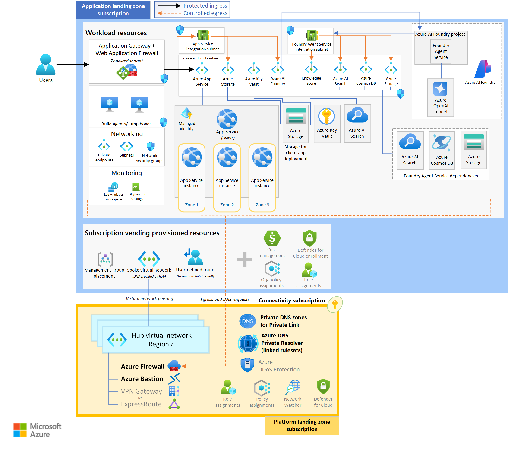

# Azure AI Foundry — Private Landing Zone (Terraform)

Terraform that stands up a private, network-isolated Azure AI Foundry
(Azure AI Studio) environment: one resource group, one Foundry account +
default project, and the private Storage/Cosmos DB/AI Search/monitoring
dependencies a Standard agent setup needs — all behind private endpoints,
AAD-only auth, and RBAC wired automatically.

## Architecture

This landing zone deploys the **application landing zone** half of the
diagram below (workload resources + subscription vending), and expects an
existing **platform landing zone** (hub network, Azure Firewall, DNS
Private Resolver, private DNS zones, DDoS Protection) to peer against —
this Terraform does not create the hub.



Key points the diagram highlights:

- **Protected ingress / controlled egress** — the Application Gateway + WAF
  is the only public entry point; all outbound traffic from the workload
  subnets is forced through the hub's Azure Firewall (egress and DNS
  requests shown flowing down to the connectivity subscription).
- **Everything workload-side sits behind private endpoints** in a dedicated
  private-endpoints subnet — App Service, Storage, Key Vault, the AI Foundry
  account, AI Search, Cosmos DB — with the Foundry Agent Service and App
  Service each in their own delegated integration subnet.
- **Foundry Agent Service dependencies** (AI Search, Cosmos DB, Storage) are
  the same private Search/Cosmos/Storage instances this module provisions —
  the diagram's dashed box just calls out which workload resources the
  agent capability host consumes.
- **Subscription vending** provides the spoke VNet (peered to the hub,
  DNS delegated to the hub's Private Resolver), the user-defined route back
  to the regional hub firewall, management-group placement, cost management,
  Defender for Cloud enrollment, and org policy/role assignments — typically
  applied once per subscription ahead of this Terraform.

For the underlying Terraform module structure (as opposed to the full
Azure reference architecture above), see the simplified summary below.

```
Resource Group
 ├─ Monitoring (Log Analytics + App Insights, behind one AMPLS)
 ├─ Storage Account (private: blob [+ optional dfs/table])
 ├─ AI Foundry account (private, network-injected agent subnet)
 ├─ Azure AI Search (private)
 ├─ Cosmos DB (private; diagnostics -> Monitoring)
 ├─ NSG rules (agent subnet -> Azure Monitor PE, agent subnet -> DNS)
 ├─ Foundry default project
 │   ├─ connections: Storage, Cosmos DB (threads), AI Search (vectors), App Insights
 │   └─ capability host (Agents) wiring the three connections above
 └─ Additional model deployments (optional, var.model_deployments, 0..N)
```

Everything is deployed with `publicNetworkAccess` disabled and identity-based
(AAD) data-plane auth — no account keys, no shared-key connection strings.
Module dependency order in [`main.tf`](main.tf) reflects this: **Monitoring is
declared before Cosmos DB** because Cosmos DB's diagnostic settings need the
Log Analytics workspace ID, and the default project (declared last) depends on
every other module.

## Files

| File | Purpose |
|---|---|
| [`main.tf`](main.tf) | Root module: resource group, naming suffix, and all child module calls in dependency order. |
| [`locals.tf`](locals.tf) | Derived/computed names (resource group, account, storage, Cosmos, AI Search) built from `project_name` + a random suffix, so you don't have to hand-pick every resource name. |
| [`variables.tf`](variables.tf) | All input variables, with descriptions and validations. |
| [`outputs.tf`](outputs.tf) | Root-level outputs (endpoints, resource IDs) for wiring into other stacks or CI/CD. |
| [`providers.tf`](providers.tf) | Required provider versions: `azurerm >= 4.0`, `azapi >= 2.0` (used for the Foundry account/project/capability-host resources — these preview-surface APIs aren't in `azurerm` yet), `time >= 0.11`, `random >= 3.6`. |
| [`terraform.tfvars.example`](terraform.tfvars.example) | Example variable values with placeholders — copy to `terraform.tfvars` (git-ignored) and fill in your own subscription/network values. |
| [`modules/`](modules/) | The 8 child modules — see [`modules/README.md`](modules/README.md). |
| [`images/`](images/) | Reference architecture diagram used above. |

## Deploying additional models

The `foundry` module can optionally create one default model deployment
(`enable_default_model_deployment`), but most environments need more than
one model. Add entries to `var.model_deployments` (see the commented example
in [`terraform.tfvars.example`](terraform.tfvars.example)) and the root module
creates one [`modules/foundryModel`](modules/foundryModel/) instance per entry
via `for_each` — no changes to `main.tf` needed:

```hcl
model_deployments = {
  "chat-gpt-4o-mini" = {
    model_name    = "gpt-4o-mini"
    model_version = "2024-07-18"
    sku_name      = "GlobalStandard" # optional, this is the default
    capacity      = 50               # optional, defaults to 1
  }
}
```

Deployment IDs are exposed via the `model_deployment_ids` output (a map keyed
by deployment name).

## Usage

```bash
cd ai-foundry/terraform
cp terraform.tfvars.example terraform.tfvars
# edit terraform.tfvars with your subscription ID, resource group, VNet/subnet
# IDs, private DNS zone IDs, and NSG names

terraform init
terraform plan
terraform apply
```

`terraform.tfvars` is git-ignored (see [`.gitignore`](.gitignore)) — never
commit it. It will contain real subscription IDs and network resource IDs
for your environment.

## Prerequisites

- An existing hub/spoke network with:
  - A subnet for private endpoints (Storage, AI Search, Cosmos DB, AMPLS).
  - A **delegated** subnet for Foundry agent network injection
    (`Microsoft.CognitiveServices/accounts` delegation).
  - Private DNS zones for: `privatelink.cognitiveservices.azure.com`,
    `privatelink.openai.azure.com`, `privatelink.services.ai.azure.com`,
    `privatelink.search.windows.net`, `privatelink.documents.azure.com`,
    `privatelink.blob.core.windows.net`, `privatelink.monitor.azure.com`,
    `privatelink.oms.opinsights.azure.com`, `privatelink.ods.opinsights.azure.com`,
    `privatelink.agentsvc.azure-automation.net` — linked to (or reachable
    from) the VNet.
- Contributor + User Access Administrator (or equivalent) on the target
  subscription/resource group, since the stack creates role assignments.

## After `terraform apply`

The default project's capability host is created directly by
[`modules/foundryProject`](modules/foundryProject), but if you add
**additional** projects to the Foundry account afterward (outside this
Terraform), see [`../scripts/README.md`](../scripts/README.md) for the
PowerShell scripts that grant RBAC and enable the capability host on new
projects.
